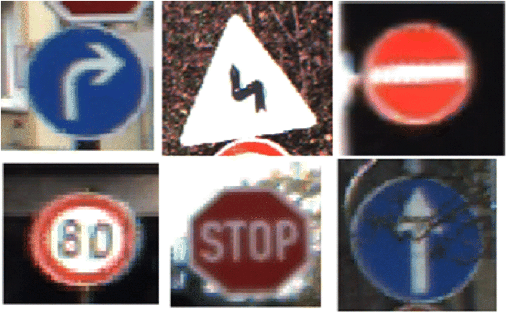
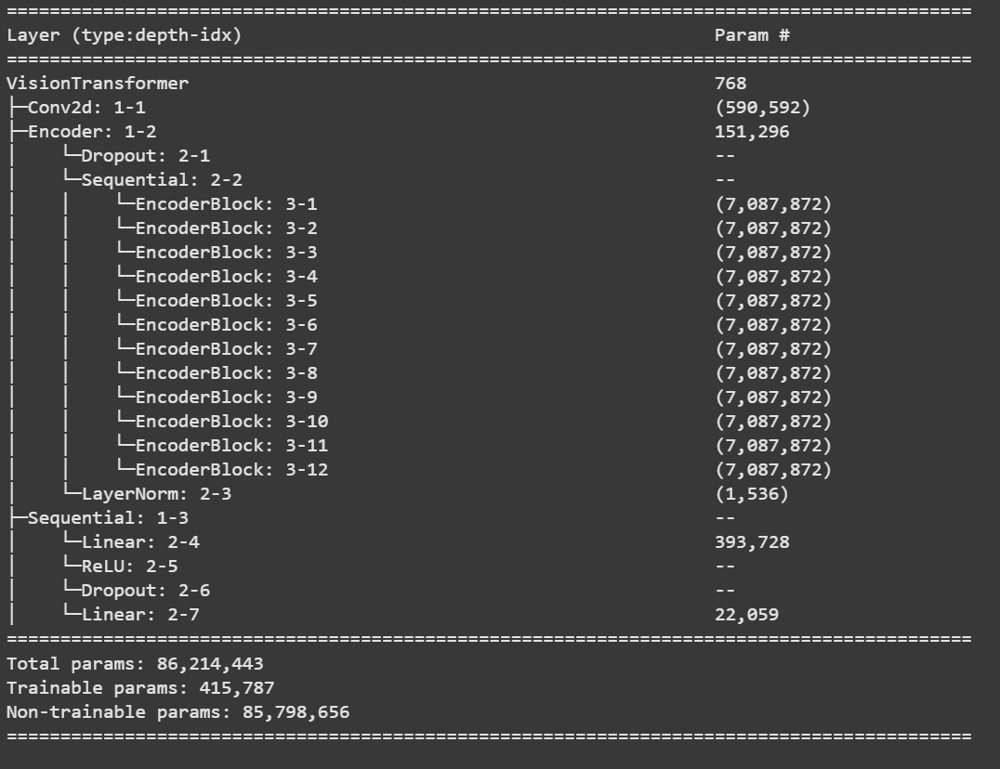
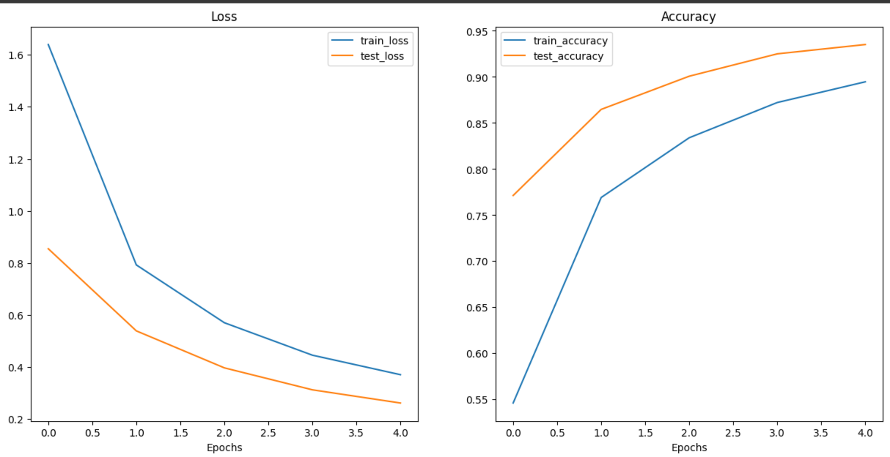
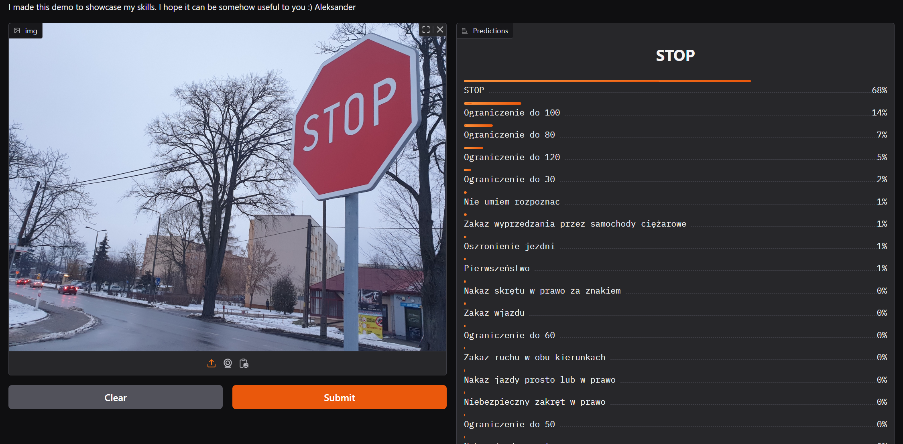

# Traffic Sign Recognition with GTSRB Dataset

A machine learning project for traffic sign classification using the German Traffic Sign Recognition Benchmark (GTSRB) dataset.

 <!-- Add your sample images path here -->

## Table of Contents
- [About](#about)
- [Dataset](#dataset)
- [Model Architecture](#model-architecture)
- [Results](#results)

## About
This project implements a deep learning model for classifying traffic signs using the GTSRB dataset. The solution achieves state-of-the-art performance in recognizing 43 different classes of traffic signs under various real-world conditions.

## Dataset
The German Traffic Sign Recognition Benchmark (GTSRB) dataset contains:
- 39,209 training images
- 12,630 test images
- 43 different classes
- Various illumination conditions and resolutions

[Official Dataset Website](https://benchmark.ini.rub.de/gtsrb_dataset.html)

## Model Architecture
My solution uses a transfer learning with Vit_b16 model, using different head to better adjust to the dataset.

## Results

### Training Strategy
- **Phase 1 (Epochs 1-5):**  
  - Base model layers frozen  
  - Only trained custom classification head  
  - Initial learning rate: 1e-3  
  
- **Phase 2 (Epoch 6):**  
  - All layers unfrozen  
  - Fine-tuned entire network  
  - Reduced learning rate: 1e-4  

### Performance Metrics
**Final Evaluation After 6 Epochs:**  
| Metric              | Value               |
|---------------------|---------------------|
| Training Accuracy   | 97.58%              |
| Training Loss       | 0.0852              |
| **Test Accuracy**   | **99.82%**          |
| Test Loss           | 0.0125              |

  
*Loss and Accuracy curves for first 5 epochs (Phase 1 training)*

### Key Observations
- Achieved **99.8% test accuracy** after just 6 epochs of training  
- Significant performance boost during final fine-tuning phase  
- Minimal overfitting despite high accuracy:
  - Train/Test gap: 2.24%  
  - Loss difference: 0.0727  

> **Note:** The validation metrics shown in graphs represent Phase 1 training only. Final epoch metrics (Phase 2) are reflected in the table above.

### Live Demo
Experience the model in action through our interactive Gradio interface:  

 

